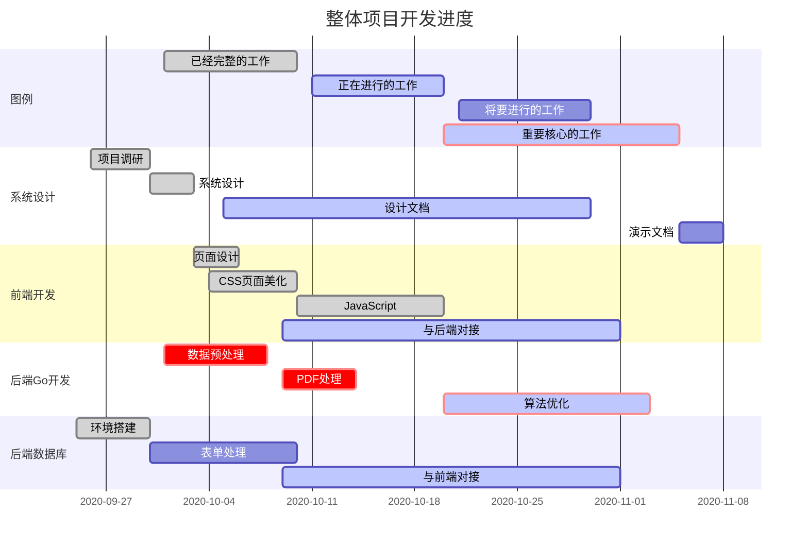

# 简历生成与管理系统项目概要说明书

<center>北京邮电大学 人工智能学院

   


### 一、项目概要

- 立项背景：

    ​		在学生寻找读研、读博、实习、求职，社会人士寻找新工作的过程中，简历是展示自我的重要方法。简历具有专业性和重复性两大特点。专业性是指，简历的内容、排版具有相当严苛的技术要求与美学要求。重复性是指简历的模板可以多次使用的复用特征。正是基于其重要但又可以复用的特征，为减少新人的简历制作时间，本项目得以提出。此外在用人单位一侧，海量的简历需要进行妥善的管理，一个便于操作的简历投递后台管理系统有助于人力资源部门提高工作效率，提高互相匹配程度，为双方节省时间、提高产出。

- 预期目标：

    ​		本项目预期实现一个多终端、跨平台、用户友好的简历自动生成系统。

    ​		本项目高阶功能期望实现一个功能强大的简历管理系统。

- 目标用户：

    ​		自动生成系统主要面向：有求学、求职需求的学生，有更换工作需求的职场人

    ​		管理系统主要面向：学校等学生录取单位，学校就业指导中心，企业、政府、事业等用人单位

    ### 二、项目需求

1. 用户无需通过百度了解简历格式，即可获得一站式内容提纲
  
2. 用户输入个人相关信息，系统自动生成pdf形式简历

3. 用户能够在多平台、多终端进行简历撰写提交
  
4. 管理员能够对已经提交简历进行存储、检索等管理操作
  
5. 管理员能够对简历进行机器自动评分
  
6. 管理员能够对简历进行按照条件筛选，对简历进行评级
  
    
  
### 三、系统功能

1. 桌面端+移动端前端显示与鉴权
  
2. 网站注册与登录
  
3. 表单填写与提交
  
4. 表单数据预处理
  
5. 生成PDF文档并提供下载
  
6. 依据自研算法对简历进行自动评分
  
7. 依据认为筛选条件对简历进行管理


 ### 四、实现平台

- 开发平台：Linux系统
  
- 开发语言：Go 语言、HTML、JavaScript、CSS、SQL
  
- 测试环境：Chrome桌面版、Firefox桌面版、Chrome移动版

### 五、系统框图


整个系统包含以下四个部分：
    

1. ###### 用户模块
  

该部分负责用户的账号注册，登录校验，修改个人信息功能
    
2. ###### 信息录入模块
  

该部分负责收集用户的个人信息，除了基本个人信息，用户也可以填写若干段工作，教育经历。最终以JSON格式传给Server
    
3. JSON解析模块
  

该部分负责解析JSON的内容，包括各个key对应的内容所在位置，内容长度，以便生成格式正确的模板，并将内容填写在正确位置
    
4. Word填写模块
  

该部分根据之前解析好的JSON信息，遍历Word模板，将JSON的内容填写到Word模板中的正确位置。最终生成用户简历。
    

    

### 六、模块实现 

##### 前端模块：

- 用户登录模块
  
    该模块用于用户登录鉴权，通过与后台数据库数据比对，确保有效用户方可进行使用本系统。
    
- 用户注册模块
  
    该模块用于用户注册，通过JavaScript与后台用户注册表进行数据传输。
    
- 表格提交模块
  
    根据网页提示，提交相关信息，完成信息采集工作，传输相关JSON格式数据至后台。
    
---

##### 前后端交互模块：

###### 用户信息处理模块

​	该模块接收网页上用户的登录注册信息，实现网页与数据库之间的通信。与前端网页对接的接口是:

```go
    getUserInfo(w http.ResponseWriter, r http.Request):

​      实时监听端口，处理网页传来的表单数据，在函数内部分析，分解后，查询数据或者是将数据插入到数据库中。同时返回网页相应的消息。      
```

- ###### 表单数据处理模块
  

​      该模块接收网页上用户填入的简历信息，规范化数据，然后传入后端处理的JSON解析模块。
​ 

```go
    getForm（w http.ResponseWriter, r http.Request）
```

​      实时监听端口，处理网页传来的网页表单数据，规范化后，传入后端处理的JSON解析模块。
​       

##### 后端处理设计：

###### JSON解析模块

```go
    FindJson (res *simplejson.Json, Word_Key string) string
    ​    输入：JSON, 内容所在键值对的Key
    ​    返回：Value
   
    FindJson_Arr(res *simplejson.Json, Arr_Key string, Word_Key string, num int) string
    
    ​    输入：JSON, 数组名称，内容所在键值对的Key，内容所在数组的序号
    ​    返回：Value
    
    SizeofArr(res *simplejson.Json, Arr_Key string) int
	​    输入：JSON, 数组名称 
    ​    返回：数组长度

    SizeofArr(res *simplejson.Json, Arr_Key string) int
    ​    输入：JSON, 数组名称 
    ​    返回：数组长度
    
```

###### 文档填写模块

```go
    func Word_insert(res *simplejson.Jon, r document.Run)
	​    输入：JSON, 文档关键字 
	​    功能：将文档关键字替换为对应的内容
	​    返回：无
```
```go
func Word_insert_arr(res *simplejson.Json, reader document.Run, writer document.Run, Arr_key string, num int)
	 ​    输入：JSON, 文档关键字 ，数组对应内容块的起始地点，数组名称，数组长度
	 ​    功能：将文档关键字替换为对应的数组内容
	 ​    返回：无
```


##### 数据库设计：

 ###### 主贴信息表设计如下:


|  字段名  |    类型     |   注释   |
| :------: | :---------: | :------: |
| UserName | Varchar(50) |  用户名  |
| Password | Varchar(50) |   密码   |
|  Email   | Varchar(50) |   邮箱   |
|  Phone   | Varchar(50) | 手机号码 |

### 七、开发进度



